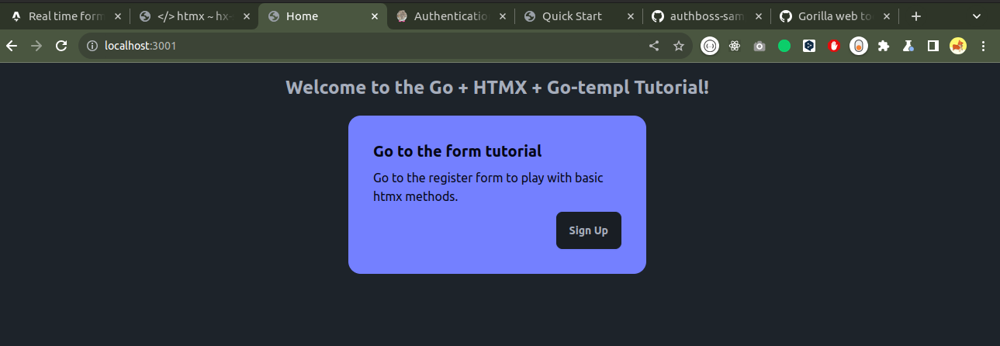
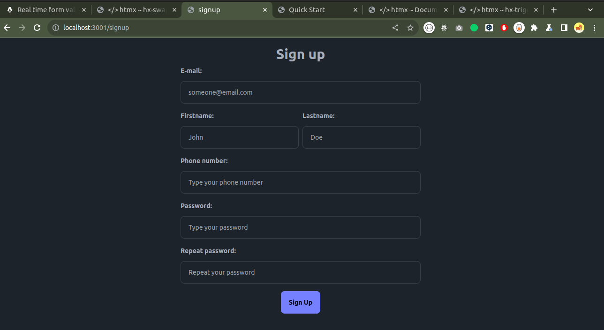
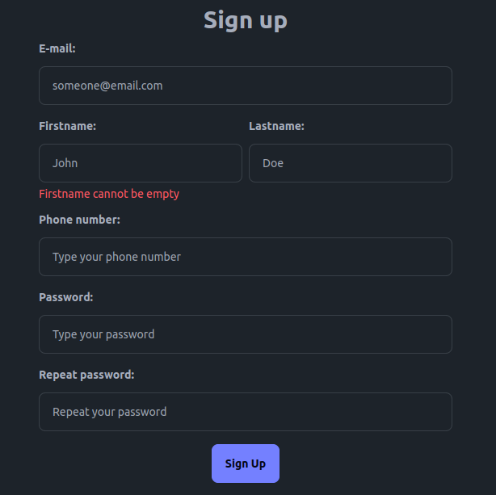

HTMX is a library that _gives you access to AJAX, CSS Transitions, WebSockets and Server Sent Events directly in HTML, using attributes, so you can build modern user interfaces with the simplicity and power of hypertext **(htmx.org)**_.

For me as a web software developer trying to add interactivity to a web page meant until recently or adding vanilla Javascript or using a frontend framework like Angular, Svelte, Vue or React (NextJS). But no more, with HTMX the HTML with superpowers there is no need to be worried about how we could add interactivity to our web page. This is a new approach for building web apps. A mix between frontend and backend development that let us as web developer to think different how we build our websites.

Maybe I am wrong but the normal approach these days to start building a web app is to separate the frontend and the backend. We start with a Library or Framework like React to build the UI. Then on the backend we build the REST API or GraphQL endpoints for future communications. Then on the frontend we call that API for authentication, CRUDs, some special endpoints for extra information, etc. All this process could become very tedious when building an application because the backend and the frontend are dependent of the API definition. If some endpoint of the API changes you have to verify all sections that use that endpoint on the frontend so they follow the new changes.

But that's not all, if some of you work in a medium-large teams communication between the frontend and backend roles has to be effective in order to have a clear path on what will be implemented. That could lead to time delays in the development. That's why we need to look for more quick solutions to ship fast and have clients or employer happy with our performance. A solution arise these days with HTMX let's see why.

Ok that's too much words for simple article on how to use HTMX let's start with the code 🦾.

<h1 id="setup">Tech stack setup & Introduction <a href="#setup">#</a></h1>
We'll use Go with the echo framework and Templ to build a basic register form with extra interactivity for real time validations. On a folder start new go project typing:

```bash
go mod init htmx/example
```

Before adding echo in your project you'll need to install echo framework, follow the official docs <a href="https://echo.labstack.com/docs/quick-start#installation" target="_blank">instructions</a>. To add templ to the project also follow the <a href="https://templ.guide/quick-start/installation" target="_blank">docs installation instructions</a>.

> Templ is also a so powerful tool in the Go ecosystem that let us build components in a really easy manner. Definitely I'll do another article about it in the future.

For styles we'll use tailwindCSS with DaisyUI a bootstrap like components library.

<h1 id="structure">Project structure <a href="#structure">#</a></h1>
The project structure will be the following:

```
.
├── assets
│   ├── css
│   │   └── daisyui.min.css
│   └── js
│       ├── htmx.min.js
│       └── tailwind.min.js
├── go.mod
├── go.sum
├── handler
│   ├── home.go
│   ├── signup.go
│   └── utils.go
├── main.go
├── Makefile
├── README.md
└── view
    ├── layout
    │   ├── base.templ
    │   └── base_templ.go
    └── pages
        ├── home.templ
        ├── home_templ.go
        ├── signup.templ
        └── signup_templ.go
```

The `assets` directory will contain the usual static files like css, javascript, etc files. In this case we are loading tailwindCSS, htmx and daisyUI libraries. The `handler` folder contains the controller functions to handle different http requests, in this case we'll have handlers for home (path: `/`) and signup (path: `/signup`), we'll see more code in next steps. The `view` folder contains the **templ** components and pages, you can view this directory as a merge between `components` and `pages` directories in NextJS framework.  
Finally the `main.go` file will be the entrypoint for our web app. The `Makefile` file is for running the start commands.

<h1 id="home-page">Rendering the Home page <a href="#home-page">#</a></h1>

We'll start with the process of rendering the home page to know all the flow of working with echo framework and templ components. Below is defined the <span id="main-function">`main.go`</span> file, in this file we define the routes and other middlewares.

```go
package main

import (
	"github.com/labstack/echo/v4"
	"github.com/webtaken/go-templ/handler"
)

type DB struct{}

func main() {
	e := echo.New()

	e.Static("/static", "assets")
	e.GET("/", handler.Home)
	e.GET("/signup", handler.SignUp)
	e.POST("/signup-validation", handler.SignUpValidation)
	e.Logger.Fatal(e.Start(":3001"))
}
```

Notice the static middleware, <span id="static-loading">`e.Static("/static", "assets")`</span> means that all calls to `/static/js/some.js` in html will point out to `assets/js/some.js` in our projects structure. We use this middleware to serve HTMX, TailwindCSS and DaisyUI.  
There is also defined three routes: `/` for the main route, `/signup` for the signup form and `/signup-vlidation` is for the htmx validations we'll see later. Finally we serve the app on 3001 port.

The handler for `/` route called home is defined below, basically we will render Home page.

```go
package handler

import (
	"github.com/labstack/echo/v4"
	"github.com/webtaken/go-templ/view/pages"
)

func Home(c echo.Context) error {
	return render(c, pages.Home())
}
```

Let's understand the `render` function and the templ component `Home`. The `render` function is defined on the `handler/utils.go`, see below.

```go
package handler

import (
	"unicode"

	"github.com/a-h/templ"
	"github.com/labstack/echo/v4"
)

func render(c echo.Context, component templ.Component) error {
	return component.Render(c.Request().Context(), c.Response())
}
```

This function will receive the context object from echo framework and a templ component. Then the function will call the render method from the component and write it to the context as response.  
The `Home()` page (templ component) in `view/pages/home.templ` is written below.

```go
package pages

import "github.com/webtaken/go-templ/view/layout"

templ Home() {
	@layout.Base("Home") {
		<h1 class="text-center text-2xl font-bold">
			Welcome to the Go + HTMX + Go-templ Tutorial!
		</h1>
		<div class="flex justify-center my-5">
			<div class="card w-96 bg-primary text-primary-content">
				<div class="card-body">
					<h2 class="card-title">Go to the form tutorial</h2>
					<p>Go to the register form to play with basic htmx methods.</p>
					<div class="card-actions justify-end">
						<a href="/signup" class="btn">Sign Up</a>
					</div>
				</div>
			</div>
		</div>
	}
}
```

Before rendering the Home component notice we wrapped it's content inside the `Base` component from layout view. The layout will be used as a wrapper for every page in the web app to load the static libraries: HTMX, TailwindCSS, etc. The `layout.Base()` component is defined below (located in `view/layout/base.templ`).

```go
package layout

templ Base(pageTitle string) {
	<!DOCTYPE html>
	<html lang="en">
		<head>
			<meta charset="utf-8"/>
			<meta name="viewport" content="width=device-width, initial-scale=1.0"/>
			<meta name="description" content=""/>
			if pageTitle != "" {
				<title>{ pageTitle }</title>
			} else {
				<title>Htmx + Go tutorial</title>
			}
			<!-- Daisy UI -->
			<link href="/static/css/daisyui.min.css" rel="stylesheet" type="text/css"/>
			<!-- Tailwind CSS -->
			<script src="/static/js/tailwind.min.js" defer></script>
			<script>
				tailwind.config = {
					corePlugins: {
						preflight: false,
					}
				}
			</script>
			<!-- HTMX -->
			<script src="/static/js/htmx.min.js" defer></script>
		</head>
		<body class="mt-4 mx-2">
			{ children... }
		</body>
	</html>
}
```

On the layout we define the global wrapper for all pages, notice the `pageTitle` parameter that is used in the `<title></title>` tag, in case it's empty we set a default one **Htmx + Go tutorial**. Then on the header tag is loaded the static libraries (HTMX, TailwindCSS and DaisyUI), check the <a href="#static-loading">explanation</a>. Finally the `{ children... }` statement is used for the components wrapped inside the layout, is the same as the children parameter in ReactJS.  
Finally on the Home page we are rendering a card that invites the user to go to the signup page, see the image below.



<h1 id="signup-page">Rendering the SignUp page <a href="#signup-page">#</a></h1>

Now let's render the SignUp page where will be the register form. The controller responsible of this is the `SignUp` function defined below.

```go
// handler/signup.go

package handler

import (
	"net/http"
	"net/mail"
	"strconv"

	"github.com/labstack/echo/v4"
	"github.com/webtaken/go-templ/view/pages"
)

func SignUp(c echo.Context) error {
	return render(c, pages.SignUp())
}
...
```

It's almost equal to the `Home()` handler we simply render the `SignUp` templ component from pages package.  
Then comes the signup page where we define the signup form.

```go
// view/pages/signup.templ

package pages

import "github.com/webtaken/go-templ/view/layout"

templ SignUp() {
	@layout.Base("signup") {
		<h1 class="text-3xl text-center font-bold">Sign up</h1>
		<div class="flex justify-center my-2">
			<form method="post" class="w-2/5 text-sm">
				<div class="form-control mb-3 w-full space-y-1">
					<label for="email" class="font-semibold mb-2">E-mail:</label>
					<input id="email" name="email" type="email" placeholder="someone@email.com" class="input input-bordered text-sm" hx-post="/signup-validation?field=email" hx-target="#email-errors" hx-swap="outerHTML" hx-trigger="keyup changed delay:500ms"/>
					<span id="email-errors" class="text-sm text-error"></span>
				</div>
				<div class="grid grid-cols-1 md:grid-cols-2 gap-x-2 w-full">
					<div class="form-control mb-3 w-full space-y-1">
						<label for="firstname" class="font-semibold mb-2">Firstname:</label>
						<input id="firstname" name="firstname" type="text" placeholder="John" class="input input-bordered text-sm" hx-post="/signup-validation?field=firstname" hx-target="#firstname-errors" hx-trigger="keyup changed delay:500ms"/>
						<span id="firstname-errors" class="text-sm text-error"></span>
					</div>
					<div class="form-control mb-3 w-full space-y-1">
						<label for="lastname" class="font-semibold mb-2">Lastname:</label>
						<input id="lastname" name="lastname" type="text" placeholder="Doe" class="input input-bordered text-sm" hx-post="/signup-validation?field=lastname" hx-target="#lastname-errors" hx-trigger="keyup changed delay:500ms"/>
						<span id="lastname-errors" class="text-sm text-error"></span>
					</div>
				</div>
				<div class="form-control mb-3 space-y-1">
					<label for="phone" class="font-semibold mb-2">Phone number:</label>
					<input id="phone" name="phone" type="tel" placeholder="Type your phone number" class="input input-bordered text-sm" hx-post="/signup-validation?field=phone" hx-target="#phone-errors" hx-trigger="keyup changed delay:500ms"/>
					<span id="phone-errors" class="text-sm text-error"></span>
				</div>
				<div class="form-control mb-3 space-y-1">
					<label for="password1" class="font-semibold mb-2">Password:</label>
					<input id="password1" name="password1" type="password" placeholder="Type your password" class="input input-bordered text-sm" hx-post="/signup-validation?field=password1" hx-target="#password1-errors" hx-trigger="keyup changed delay:500ms"/>
					<span id="password1-errors" class="text-sm text-error"></span>
				</div>
				<div class="form-control mb-3 space-y-1">
					<label for="password2" class="font-semibold mb-2">Repeat password:</label>
					<input id="password2" name="password2" type="password" placeholder="Repeat your password" class="input input-bordered text-sm" hx-post="/signup-validation?field=password2" hx-target="#password2-errors" hx-trigger="keyup changed delay:500ms"/>
					<span id="password2-errors" class="text-sm text-error"></span>
				</div>
				<div class="flex justify-center">
					<button class="btn btn-primary">
						Sign Up
					</button>
				</div>
			</form>
		</div>
	}
}
```

We wrap the hole page with the form inside the base layout, we set the title of the page as `"signup"`. For the register form we will take the following fields: email, firstname, lastname, phone and the password. The result is shown below.



<h1 class="htmx-validations">Form validations with HTMX <a href="#htmx-validations">#</a></h1>

Let's explain a simple form field that uses htmx tag attributes, below there is the firstname field for the form.

```html
...
<div class="form-control mb-3 w-full space-y-1">
  <label for="firstname" class="font-semibold mb-2">Firstname:</label>
  <input
    id="firstname"
    name="firstname"
    type="text"
    placeholder="John"
    class="input input-bordered text-sm"
    hx-post="/signup-validation?field=firstname"
    hx-target="#firstname-errors"
    hx-trigger="keyup changed delay:500ms"
  />
  <span id="firstname-errors" class="text-sm text-error"></span>
</div>
...
```

The firstname field contains the usual attributes in the input tag: id, name, type (text), placeholder and class for styling. But there are three extra attributes, `hx-post`, `hx-target` and `hx-trigger`, that htmx uses.

The `hx-post` attribute is used for doing post requests to the specified value. As in the documentation of <a href="https://htmx.org/docs/#ajax" target="_blank">htmx-ajax</a> we can do common http requests: GET, POST, PUT, PATCH, DELETE.

The other attribute is `hx-target`, this attribute is used as a selector of elements in the DOM. In the background when a http request (e.g. hx-post) finishes htmx replaces the response into an element or can replace directly the whole element, that element is found with `hx-target`. In our example the value of `hx-target` is **#firstname-errors** that means that the response will be inserted inside the `<span></span>` tag with the id **firstname-errors** below the input. Check the <a href="https://htmx.org/docs/#targets" target="_blank">hx-target documentation</a> for more information.

Finally the `hx-trigger` attribute is used for listening events from the user to detach the AJAX requests. In our example the events we're listening are **keyup** and **changed**. Apart from the events we can define behaviors for those events, in the example is defined `delay:500ms`. That means we delay the post request 500 milliseconds after some event finish, and in case the event is triggered again the request is cancelled until the event trigger finishes and delays 500ms again. This trick is known as debouncing, and prevents from doing too much requests when a certain event happens. Read the <a href="https://htmx.org/attributes/hx-trigger/" target="_blank">docs about hx-trigger</a> to know what else you can do.

Now let's continue with the function used for validation of the form fields. Notice that the value of `hx-post="/signup-validation?field=firstname"`, this endpoint is defined in the <a href="#main-function">main function</a> and accepts a query parameter called `field` so that the function could identify which field will be validated. Then the controller for this function is defined below.

```go
// handler/signup.go

...

type RegisterFormData struct {
	Email     string `form:"email" json:"email"`
	Firstname string `form:"firstname" json:"firstname"`
	Lastname  string `form:"lastname" json:"lastname"`
	Phone     string `form:"phone" json:"phone"`
	Password1 string `form:"password1" json:"password1"`
	Password2 string `form:"password2" json:"password2"`
}

func SignUpValidation(c echo.Context) error {
	alreadyRegisteredEmails := []string{
		"koki@gmail.com", "popi@hotmail.com", "babyBoomer123@outlook.com",
	}
	field := c.QueryParam("field")
	var registerData RegisterFormData
	err := c.Bind(&registerData)
	if err != nil {
		return c.String(http.StatusBadRequest, "")
	}
	if field == "email" {
		for _, email := range alreadyRegisteredEmails {
			if email == registerData.Email {
				return c.String(http.StatusOK, "<span id=\"email-errors\" class=\"text-sm text-error\">This username is already registered</span>")
			}
		}

		_, err := mail.ParseAddress(registerData.Email)
		if err != nil {
			return c.String(http.StatusOK, "<span id=\"email-errors\" class=\"text-sm text-error\">Your e-mail is invalid</span>")
		}

		return c.String(http.StatusOK, "<span id=\"email-errors\" class=\"text-sm text-success\">Correct email</span>")
	} else if field == "firstname" {
		if registerData.Firstname == "" {
			return c.String(http.StatusOK, "Firstname cannot be empty")
		}
	} else if field == "lastname" {
		if registerData.Lastname == "" {
			return c.String(http.StatusOK, "Lastname cannot be empty")
		}
	} else if field == "phone" {
		if registerData.Phone == "" {
			return c.String(http.StatusOK, "Phone cannot be empty")
		}
		if _, err := strconv.Atoi(registerData.Phone); err != nil {
			return c.String(http.StatusOK, "Doesn't look like a Phone")
		}
	} else if field == "password1" {
		eightOrMore, number, upper, special := verifyPassword(registerData.Password1)
		if !eightOrMore || !number || !upper || !special {
			return c.String(
				http.StatusOK,
				"Password rules:<br/>at least 8 characters long<br/>at least 1 number<br/>at least 1 uppercase<br/>at least 1 special character",
			)
		}
	} else if field == "password2" {
		if registerData.Password2 != registerData.Password1 {
			return c.String(http.StatusOK, "Passwords don't match")
		}
	}
	return c.String(http.StatusOK, "")
}
```

The `RegisterFormData` struct type is used for parsing the form fields in form and json format. The struct tags are used for what is called in echo as <a href="https://echo.labstack.com/docs/binding" target="_blank">binding</a>, it's in simply words decoding in different formats (from, json, query params, etc).

```go
// handler/signup.go

...

type RegisterFormData struct {
	Email     string `form:"email" json:"email"`
	Firstname string `form:"firstname" json:"firstname"`
	Lastname  string `form:"lastname" json:"lastname"`
	Phone     string `form:"phone" json:"phone"`
	Password1 string `form:"password1" json:"password1"`
	Password2 string `form:"password2" json:"password2"`
}

func SignUpValidation(c echo.Context) error {
	alreadyRegisteredEmails := []string{
		"koki@gmail.com", "popi@hotmail.com", "babyBoomer123@outlook.com", // Explained later
	}
	field := c.QueryParam("field") // <- Getting the query param "field" to know which field validate
	var registerData RegisterFormData
	err := c.Bind(&registerData) // <- Here happens the binding (decoding)
	if err != nil {
		return c.String(http.StatusBadRequest, "")
	}
    ...
}
```

After the binding of the form fields we also check the the query param **"field"** to validate specific fields. In our example of **firstname** we only want to check if it isn't empty.

```go
// handler/signup.go

...

func SignUpValidation(c echo.Context) error {
    ...
    else if field == "firstname" {
		if registerData.Firstname == "" {
			return c.String(http.StatusOK, "Firstname cannot be empty")
		}
	}
    ...
}
```

When the firstname is empty we return a warning text. The result is shown below.



> The validation is partially ok but what if we write down only white spaces 🤔?

<h1 id="htmx-extra">Extra use case for HTMX <a href="#htmx-extra">#</a></h1>

There is a special field we can play with to deep dive into htmx, the email field is special because it has to be unique for every user registering to our web app. A cool use case is whenever a user types an email (or username) we can indicate him/her if the email (or username) is available or not. Do this with htmx is really simple we just have to do some tiny changes, see below.

```html
<div class="form-control mb-3 w-full space-y-1">
  <label for="email" class="font-semibold mb-2">E-mail:</label>
  <input
    id="email"
    name="email"
    type="email"
    placeholder="someone@email.com"
    class="input input-bordered text-sm"
    hx-post="/signup-validation?field=email"
    hx-target="#email-errors"
    hx-swap="outerHTML"
    hx-trigger="keyup changed delay:500ms"
  />
  <span id="email-errors" class="text-sm text-error"></span>
</div>
```

The htmx tags are similar to the other fields in the form but there is an extra one. The `hx-swap` attribute is used for controlling the way htmx swap the response from the http request url into the target element. In this case `outerHTML` will replace the whole target element, check the <a href="https://htmx.org/attributes/hx-swap/" target="_blank">`hx-swap` documentation</a>.

Now let's see the section in the `SignUpValidation()` function responsible for the email validation. See the code below.

```go
// handler/signup.go
...
func SignUpValidation(c echo.Context) error {
	alreadyRegisteredEmails := []string{
		"koki@gmail.com", "popi@hotmail.com", "babyBoomer123@outlook.com",
	}
	field := c.QueryParam("field")
	var registerData RegisterFormData
	err := c.Bind(&registerData)
	if err != nil {
		return c.String(http.StatusBadRequest, "")
	}
	if field == "email" {
		for _, email := range alreadyRegisteredEmails {
			if email == registerData.Email {
				return c.String(http.StatusOK, "<span id=\"email-errors\" class=\"text-sm text-error\">This username is already registered</span>")
			}
		}

		_, err := mail.ParseAddress(registerData.Email)
		if err != nil {
			return c.String(http.StatusOK, "<span id=\"email-errors\" class=\"text-sm text-error\">Your e-mail is invalid</span>")
		}

		return c.String(http.StatusOK, "<span id=\"email-errors\" class=\"text-sm text-success\">Correct email</span>")
	}
    ...
```

The first validation simulate a database search of already registered emails. If you type one of the emails on the slice `alreadyRegisteredEmails` htmx will return a span element with the same id as the rendered initially. If you payed attention this is done this way because of the `hx-swap` attribute that will replace the whole target element. In case we return only a string htmx won't longer be able to replace an element on the DOM since **email-errors** id disappeared with the first response.

The second validation is checking the format of the email, fortunately Go has a function from the standard library `mail.ParseAddress()` to check that. In case the email pass the two validations the same span will be returned but with a slightly difference, we change the `text-error` class value by `text-success`. Now when an email is correct we can see a green text saying that the email is correct.

See the image below.


<h1 id="source-code">Source Code <a href="#source-code">#</a></h1>

Download the project on github: <a href="https://github.com/webtaken/go-templ" target="_blank">https://github.com/webtaken/go-templ</a>.

<h1 id="conclusion">Conclusion <a href="#conclusion">#</a></h1>

On next posts I'll continue deep diving on HTMX. With this "new" tool more and more developers will be able to work on the backend and the frontend. Hope you found this post useful for your next projects 👊.
