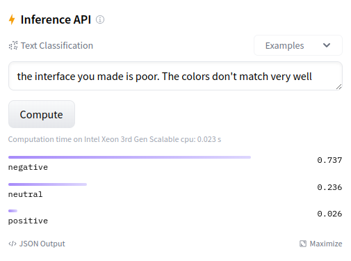

With the hype of **#AI** <a href="https://huggingface.co/" target="_blank">Hugging Face 🤗</a> has
become one of the trending companies related to this field. Is known as the github of AI for
its particular way of making AI open source and also because of the massive amount of models
hosted on it.  
Literally in this place you can find any model related to the most common tasks in AI:

- Multimodal: Text-to-image and reverse generation, Image captioning, visual question answering...
- Computer Vision: Image classification, Object detection, Depth estimation...
- NLP: Text generation, Summarization, Sentiment analysis, Translation, Dialog systems...
- Audio: Text-to-speech, Speech-to-text, Speaker identification...

But for me the real power of Hugging Face and its huge amount of models is that you can use them using a simple API call!
<a href="https://huggingface.co/inference-endpoints" target="_blank">Inference Endpoints</a> is a service that let you use different models deployed on Hugging Face infrastructure only making a simple API call using a token.  
So let's start with setup process and see how you can start integrating AI models as features
is your side project

<h1 id="setup">Getting Setup <a href="#setup">#</a></h1>

So to start first <a href="https://huggingface.co/join">create a Hugging Face Account</a>.  
Once you're logged in explore the <a href="https://huggingface.co/models">models</a> section where you'll find the most popular models shared on the platform.  
You can filter then by tasks, libraries, datasets, languages, licenses, etc. But the most important filter for us right now is the _Tasks_ filter.  
So to start our models exploration let's pick the models related to NLP for **Sentiment Analysis**.

<h1 id="sentiment-analysis">Sentiment Analysis <a href="#sentiment-analysis">#</a></h1>

First of all let's explore the sentiments analysis models, let's take for example the
<a href="https://huggingface.co/lxyuan/distilbert-base-multilingual-cased-sentiments-student" target="_blank">distilbert</a> model that classifies a text if it's negative, neutral or positive.
Simple and easy just use the widget attached on Inference API to make a quick test and you'll receive a response in seconds.



Ok that's cool but let's go to the point of this post.

<h1 id="inference-api">Inference API <a href="#inference-api">#</a></h1>

First let's setup a token to use Inference API to do that <a href="https://huggingface.co/settings/tokens" target="_blank">go into your Hugging Face profile settings</a> and generate a new API.
You should see a token hf_xxxxx (old tokens are api_XXXXXXXX or api_org_XXXXXXX).  
Now let's go back to the <a href="https://huggingface.co/lxyuan/distilbert-base-multilingual-cased-sentiments-student" target="_blank">distilbert</a> model page
and test out if our token works correctly, you'll see a section with various options


Select Deploy and then the option **Inference API**, you'll see a panel with examples from
python, javascript and CURL, pick whatever you want. I'll choose python to test it with code.

```python
import os
from dotenv import load_dotenv
import requests
import json

load_dotenv()

TOKEN = os.getenv("HUGGING_FACE_API_TOKEN")
API_URL = "https://api-inference.huggingface.co/models/lxyuan/distilbert-base-multilingual-cased-sentiments-student"
headers = {"Authorization": f"Bearer {TOKEN}"}

def query(payload):
	response = requests.post(API_URL, headers=headers, json=payload)
	return response.json()

output = query({
	"inputs": "I like you. I love you",
})

print(json.dumps(output, indent=2, default=str))
```

That outputs

```json
[
  [
    {
      "label": "positive",
      "score": 0.9725496172904968
    },
    {
      "label": "neutral",
      "score": 0.018842175602912903
    },
    {
      "label": "negative",
      "score": 0.008608155883848667
    }
  ]
]
```

> Note: some models need to be loaded before sending any response so you could receive an initial error `model loading...`.

We could also send a list of messages to make the process in batch.

```python
output = query({
	"inputs": ["I like you. I love you", "I hate you", "Hope everything goes well"],
})

print(json.dumps(output, indent=2, default=str))
```

Outputs:

```json
[
  [
    {
      "label": "positive",
      "score": 0.9725496172904968
    },
    {
      "label": "neutral",
      "score": 0.018842175602912903
    },
    {
      "label": "negative",
      "score": 0.008608155883848667
    }
  ],
  [
    {
      "label": "negative",
      "score": 0.8973513245582581
    },
    {
      "label": "positive",
      "score": 0.06305788457393646
    },
    {
...
      "score": 0.07286641001701355
    }
  ]
]
```

You can test API inference endpoints with various other models in the platform depending on your needs.

> Source code: [https://github.com/webtaken/AI-scripts/blob/main/hugging-face/hugging-face-inference.ipynb](https://github.com/webtaken/AI-scripts/blob/main/hugging-face/hugging-face-inference.ipynb).

<h1 id="restrictions">Restrictions <a href="#restrictions">#</a></h1>

Despite the Inference API is free it has a limit rate for requests, and let's no say lies nothing
in life comes for free. In case you found a set of models that seems very useful to implement in a process of your side-project you can upgrade to the Pro Plan starting in $9 to improve your rate limit.

<h1 id="conclusion">Conclusion <a href="#conclusion">#</a></h1>

Hugging Face provides many models for you to use with its Inference API. It can become one new feature for your side project or even you can base your entire project on top of a model.  
In next posts we will continue exploring very interesting Hugging Face models to make fun projects.
Anyway continue creating my Indie Creator and don't give up 😉.
