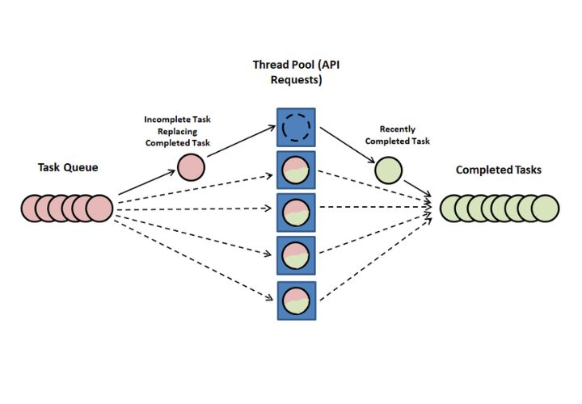

Welcome to a new blog post dear visitor – In this post, we'll code a very interesting tool to analyze
the comments of a youtube video. Using the power of go routines, hugging face models and Youtube data API we'll code a basic sentiment analyzer that will classify the comments of any youtube video on internet.

Nowadays with the hype of AI almost anyone can combine different AI tasks (`Text-to-Image`, `Image to-Text`, `Natural Language Processing Tasks`, etc) to many sources of information and apps: text editors, videos, images, personal calendars, etc etc.
All this process can take too much time in many cases, that's why we need fast programming languages that let us take an input and process it as fast as possible. Go has a great advantage with its focus in concurrency, apart from being a compiled language.

So let's start building our sentiment analyzer for our youtube videos, you can find the source code on github.

> Source code: <a href="https://github.com/webtaken/GoLearning/tree/main/video-analysis" target="_blank">video-analysis</a>.

<h1 id="setup">Setup <a href="#setup">#</a></h1>

Our tech stack will consist of three tools **Go (programming language)**, **Youtube Data API (v3)** `token` to extract the comments from the videos and **Hugging Face Inference models**. Here are the steps to get all of them, once you have all set up come back to the tutorial:

- To install Go in your computer you can go to the official documentation: <a href="https://go.dev/doc/install" target="_blank">here</a>.
- To get a Youtube Data API token see this <a href="https://blog.hubspot.com/website/how-to-get-youtube-api-key" target="_blank">tutorial</a> on how to get one.
- To get a Hugging Face Inference API key you can go to the <a href="https://huggingface.co/docs/api-inference/quicktour" target="_blank">official documentation</a> or if you want to know more about this service check my <a href="./hugging-face-low-cost-models" target="_blank">blog post</a>.

Once you have all this set up let's create the directory for our project **_use wsl if you use windows_**.

```
mkdir sentiment-analysis
cd sentiment-analysis
touch sentiment-analysis
go init sentiment-analysis
```

Then we'll install the sdk for Youtube API and that's all that we need to start our project.

```
go get google.golang.org/api/youtube/v3
```

<h1 id="getting-started">Getting started <a href="#getting-started">#</a></h1>

The first step we'll do is to retrieve basic data from a video using the Youtube API. Our program will receive two parameters a YT video ID, those that appear in the query param `?v=<videoId>` every time we watch a video in our browser e.g `https://www.youtube.com/watch?v=446E-r0rXHI&ab_channel=Fireshi`, and the number of comments we want to analyze.

> Note: The comments we'll analyze will be the top comments of a video not replies.

So our initial `main` function starts like this:

```go
var youtubeAPIToken = os.Getenv("YOUTUBE_API_TOKEN")
var Service *youtube.Service

func init() {
	ctx := context.Background()
	service, err := youtube.NewService(ctx, option.WithAPIKey(youtubeAPIToken))
	if err != nil {
		log.Fatalf("%v\n", err)
	}
	Service = service
}

func main() {
	var videoId string
	var numComments int
	flag.StringVar(&videoId, "videoId", "", "The id of a youtube video e.g. yyUHQIec83I")
	flag.IntVar(&numComments, "numComments", 100, "The number of comments to analyze (default: 100)")
	flag.Parse()

	if numComments <= 0 {
		log.Fatal("numComments flag must be a positive number")
	}

	videoData, err := getVideoData(videoId)

	if err != nil {
		log.Fatal(err.Error())
	}

	printYoutubeVideoData(videoData)
}
```

We define the `Service` variable of type `*youtube.Service` that is the client to do calls to the Youtube API, we initialize it on the `init` function. Notice the global variable `youtubeAPIToken` that retrieves the env var **YOUTUBE_API_TOKEN**. Also we use the built-in `flag` package in Go to parse our command parameters `videoId` and `numComments` (by default 100). We do some validations like the video id must not be empty and number of comments must be positive and not be zero.  
The function `getVideoData()` and `printYoutubeVideoData()` will be used to get and show basic data of the video we'll analyze.

```go
func getVideoData(videoId string) (*youtube.VideoListResponse, error) {
	var part = []string{"snippet", "contentDetails", "statistics"}
	call := Service.Videos.List(part)
	call.Id(videoId)
	response, err := call.Do()
	if err != nil {
		return nil, err
	}
	if len(response.Items) == 0 {
		return nil, fmt.Errorf("video not found")
	}
	return response, nil
}

func printYoutubeVideoData(videoData *youtube.VideoListResponse) {
	fmt.Printf("Video Data\n")
	fmt.Printf("Title: %s\n", videoData.Items[0].Snippet.Title)
	fmt.Printf("-------------------------------------------------\n")
	fmt.Printf("Description: %s\n", videoData.Items[0].Snippet.Description)
	fmt.Printf("-------------------------------------------------\n")
	fmt.Printf("Likes: %d\n", videoData.Items[0].Statistics.LikeCount)
	fmt.Printf("Comments Count: %d\n", videoData.Items[0].Statistics.CommentCount)
	fmt.Printf("Views Count: %d\n", videoData.Items[0].Statistics.ViewCount)
}
```

To start we'll get basic data from a video like its: Title, Description, Number of Likes, Number of Comments (top comments + replies), and the Number of Views. Let's do a try with this video (<a href="https://www.youtube.com/watch?v=446E-r0rXHI&ab_channel=Fireship" target="_blank">Go in 100 seconds</a>) with id **446E-r0rXHI**.  
To get the results we execute the command:

```
YOUTUBE_API_TOKEN=<your-youtube-api-token> go run main.go -videoId 446E-r0rXHI
```

And the output is this:

```
Video Data
Title: Go in 100 Seconds
-------------------------------------------------
Description: Learn the basics of the Go Programming Language. Go (not Golang) was developed at Google as a modern version of C for high-performance server-side applications. https://fireship.io/lessons/learn-go-in-100-lines/

#programming #go #100SecondsOfCode

🔗 Resources

Go in 100 Lines https://fireship.io/lessons/learn-go-in-100-lines/
Go Docs https://golang.org/doc/

🔥 Get More Content - Upgrade to PRO

Upgrade to Fireship PRO at https://fireship.io/pro
Use code lORhwXd2 for 25% off your first payment.

🎨 My Editor Settings

- Atom One Dark
- vscode-icons
- Fira Code Font

🔖 Topics Covered

- History of Go Development
- Programming Languages Invented by Ken Thompson
- Statically-typed Complied Languages
- Go Modules
-------------------------------------------------
Likes: 56076
Comments Count: 1106
Views Count: 1340139
```

So we have a basic script that let us know basic data from a youtube video. Let's continue.

<h1 id="sequential-analyzer">Sequential Analyzer <a href="#sequential-analyzer">#</a></h1>

Before coding our concurrent analyzer we'll start with the sequential one to have a grasp of the steps to take during the analysis.  
So the first step is to define the functions involved, we add the function `analyzeVideoSequential()`
at the last part of of the `main` function. The `analyzeVideoSequential()` function will receive the video id and the number of comments to analyze.

```go
func main() {

  ...

	fmt.Printf("\nAnalyzing video (Sequential method)...\n")
	startTime := time.Now()
	analyzeVideoSequential(videoId, numComments)
	fmt.Printf("Analysis took %.3f seconds to execute.\n", time.Since(startTime).Seconds())
}
```

The `analyzeVideoSequential()` function get the video comments and analyze with the Hugging Face
inference API a batch of comments. Let's break it down.

```go
func analyzeVideoSequential(videoId string, numComments int) {
	positive := Counter{
		Tag:     "Positive",
		Count:   0,
		Channel: make(chan int),
	}
	negative := Counter{
		Tag:     "Negative",
		Count:   0,
		Channel: make(chan int),
	}
	neutral := Counter{
		Tag:     "Neutral",
		Count:   0,
		Channel: make(chan int),
	}
	errors := Counter{
		Tag:     "Errors",
		Count:   0,
		Channel: make(chan int),
	}

	var part = []string{"id", "snippet"}
	nextPageToken := ""
	call := Service.CommentThreads.List(part)
	pageSize := BATCH // Returns a page of max BATCH size
	call.VideoId(videoId)
	call.MaxResults(int64(pageSize))
	commentsRetrieved := 0
	commentsRetrieveFailed := 0
	for commentsRetrieved < numComments {
		if nextPageToken != "" {
			call.PageToken(nextPageToken)
		}

		response, err := call.Do()
		if err != nil {
			commentsRetrieveFailed += pageSize
			continue
		}

		commentsToAnalyze := len(response.Items)
		if commentsRetrieved+commentsToAnalyze >= numComments {
			commentsToAnalyze = numComments - commentsRetrieved
		}
		commentsRetrieved += commentsToAnalyze

		batchAnalyzerSequential(response.Items[:commentsToAnalyze], &positive, &negative, &neutral, &errors)

		nextPageToken = response.NextPageToken
		if nextPageToken == "" {
			break
		}
	}

	// After all the process we show the results
	printAnalysisResults(&positive, &neutral, &negative, &errors, numComments)
}
```

<h2 id="sequential-analyzer-counters">Sequential Analyzer (Counters) <a href="#sequential-analyzer-counters">#</a></h2>

The section with four struct variables of type `Counter` will be the counters for each category positive, negative, neutral or error (whenever Hugging Face fails analyzing the comment).

```go
positive := Counter{
	Tag:     "Positive",
	Count:   0,
	Channel: make(chan int),
}
negative := Counter{
	Tag:     "Negative",
  	Count:   0,
  	Channel: make(chan int),
}
neutral := Counter{
  	Tag:     "Neutral",
  	Count:   0,
  	Channel: make(chan int),
}
errors := Counter{
  	Tag:     "Errors",
  	Count:   0,
  	Channel: make(chan int),
}
```

The `Counter` struct is defined below, we have a tag, an integer that is a counter and a channel that will be used in the concurrent program to communicate the results:

```go
type Counter struct {
	Tag     string
	Count   int
	Channel chan int
}
```

<h2 id="sequential-analyzer-comments">Sequential Analyzer (Getting the comments) <a href="#sequential-analyzer-comments">#</a></h2>

The next section is the for loop where we get the youtube video comments by pages until we reach the number of comments specified in the function parameters. We name the variable `call` to be the service that will retrieve the comments from the video. Notice the constant `BATCH` int the `MaxResults()` method, this is used to define the page size for the response. Check out the <a href="https://developers.google.com/youtube/v3/docs/comments/list" target="_blank">documentation</a> about this method in the youtube data API docs:

```go
	...
	var part = []string{"id", "snippet"}
	nextPageToken := ""
	call := Service.CommentThreads.List(part)
	call.VideoId(videoId)
	call.MaxResults(int64(BATCH))
	commentsRetrieved := 0
	commentsRetrieveFailed := 0
	for commentsRetrieved < numComments {
		if nextPageToken != "" {
			call.PageToken(nextPageToken)
		}

		response, err := call.Do()
		if err != nil {
			commentsRetrieveFailed += pageSize
			continue
		}

		commentsToAnalyze := len(response.Items)
		if commentsRetrieved+commentsToAnalyze >= numComments {
			commentsToAnalyze = numComments - commentsRetrieved
		}
		commentsRetrieved += commentsToAnalyze

		batchAnalyzerSequential(response.Items[:commentsToAnalyze], &positive, &negative, &neutral, &errors)

		nextPageToken = response.NextPageToken
		if nextPageToken == "" {
			break
		}
	}
	...
```

When there are no more pages `if nextPageToken == ""` we break the loop. Then we have the function `batchAnalyzerSequential()` that as the name suggest it will analyze a batch of comments extracted youtube. We send by reference the `&positive, &negative, &neutral, &errors` to update the counters.  
Since this is done sequentially we don't care about yet of data racing problem in concurrent programs.

<h2 id="sequential-analyzer-batch-analyzer">Sequential Analyzer (Batch Analyzer) <a href="#sequential-analyzer-batch-analyzer">#</a></h2>

The function `batchAnalyzerSequential()` is defined below, we receive an slice of `youtube.CommentsThread` pointers and the four counters. On this function we'll do an api request to the Hugging Face Inference API (`Roberta` model) to get the sentiment classification for the batch of messages. Notice the `jsonData` variable that will store the request body that is build by the function `buildRequestBody()`.  
In case of any error, building the client or not receiving an OK status from the API, we sum up to the error counter the len of the comments we are processing. And in case the api request goes well
we'll unmarshall the json response to update the `positive, negative, neutral` counters.

```go
func batchAnalyzerSequential(
	comments []*youtube.CommentThread,
	positive *Counter,
	neutral *Counter,
	negative *Counter,
	errors *Counter,
) {
	modelEndpoint := "https://api-inference.huggingface.co/models/cardiffnlp/twitter-xlm-roberta-base-sentiment"
	var jsonData = []byte(buildRequestBody(comments))
	request, err := http.NewRequest("POST", modelEndpoint, bytes.NewBuffer(jsonData))
	if err != nil {
		errors.Count += len(comments)
		return
	}
	request.Header.Set("Authorization", fmt.Sprintf("Bearer %s", huggingFaceAPIToken))

	client := &http.Client{}
	response, err := client.Do(request)
	if err != nil {
		errors.Count += len(comments)
		return
	}

	defer response.Body.Close()

	if response.StatusCode == 200 {
		body, _ := io.ReadAll(response.Body)
		var sentimentAnalysisResponse []RobertaResponse

		err := json.Unmarshal(body, &sentimentAnalysisResponse)
		if err != nil {
			errors.Count += len(comments)
			return
		}
		handleModelResponseSequential(sentimentAnalysisResponse, positive, negative, neutral)
		return
	}
	errors.Count += len(comments)
}
```

The `buildRequestBody()` function defined below is in charge of building the json body received by the Hugging Face API.

```go
func buildRequestBody(comments []*youtube.CommentThread) string {
	listFormatted := "["
	for i, comment := range comments {
		listFormatted += fmt.Sprintf("%q", comment.Snippet.TopLevelComment.Snippet.TextOriginal)
		if i < len(comments)-1 {
			listFormatted += ","
		}
	}
	listFormatted += "]"
	return fmt.Sprintf("{ \"inputs\": %s }", listFormatted)
}
```

Basically if we have two comments: **"I love you"** and **"I hate you"**, we'll end up with the json body:

```json
{
  "inputs": ["I love you", "I hate you"]
}
```

After building the request body we simply wait for the API response and we check if it returns 200 OK status, in case of success response we decode the json body, checking always for errors, and execute the function `handleModelResponseSequential()` that will update the counters for _positive, negative or neutral_ results.

```go
...
	if response.StatusCode == 200 {
		body, _ := io.ReadAll(response.Body)
		var sentimentAnalysisResponse []RobertaResponse

		err := json.Unmarshal(body, &sentimentAnalysisResponse)
		if err != nil {
			errors.Count += len(comments)
			return
		}
		handleModelResponseSequential(sentimentAnalysisResponse, positive, negative, neutral)
		return
	}
...
```

The function `handleModelResponseSequential()` is defined below. Basically we loop through an slice of type `RobertaResponse` structs, that are defined below as well. We check which tag **(Positive, Negative or Neutral)** has the highest score and we update the corresponding counter:

```go
type RobertaResponse []struct {
	Label string  `json:"label"`
	Score float64 `json:"score"`
}

func handleModelResponseSequential(
	sentimentAnalysisResponse []RobertaResponse,
	positive *Counter,
	neutral *Counter,
	negative *Counter,
) {
	for _, analysisResponse := range sentimentAnalysisResponse {
		maxScoreObj := struct {
			label string
			score float64
		}{
			label: analysisResponse[0].Label,
			score: analysisResponse[0].Score,
		}
		for _, analysis := range analysisResponse {
			if analysis.Score > maxScoreObj.score {
				maxScoreObj.label = analysis.Label
				maxScoreObj.score = analysis.Score
			}
		}

		switch maxScoreObj.label {
		case "Positive":
			positive.Count += 1
		case "Negative":
			negative.Count += 1
		case "Neutral":
			neutral.Count += 1
		}
	}
}
```

Notice that we receive the response for the two comments _I love you and I hate you_ as below, that's why the `RobertaResponse` model is defined as an slice of structs as above:

```json
[
  [
    {
      "label": "Positive",
      "score": 0.7866938710212708
    },
    {
      "label": "Neutral",
      "score": 0.16624833643436432
    },
    {
      "label": "Negative",
      "score": 0.047057848423719406
    }
  ],
  [
    {
      "label": "Negative",
      "score": 0.9430438280105591
    },
    {
      "label": "Neutral",
      "score": 0.038518112152814865
    },
    {
      "label": "Positive",
      "score": 0.018438035622239113
    }
  ]
]
```

<h2 id="sequential-analyzer-results">Sequential Analyzer (Printing the results) <a href="#sequential-analyzer-results">#</a></h2>

After looping over all the comments, analyzing each batch and updating the counters we print the results from the counters with the function `printAnalysisResults()`.

```go
func analyzeVideoSequential(videoId string, numComments int) {
	...
	// After all the process we show the results
	printAnalysisResults(&positive, &neutral, &negative, &errors, numComments)
}
```

This function is defined below and simply prints out the positive, neutral, negative and errors `Count` variable from each counter, we also print the number of comments analyzed:

```go
func printAnalysisResults(
	positive *Counter,
	neutral *Counter,
	negative *Counter,
	errors *Counter,
	numComments int,
) {
	fmt.Printf("Here are the sentiment analysis results for your video\n")
	fmt.Printf("From %d comments\n", numComments)
	fmt.Printf("Positive comments: %d\n", positive.Count)
	fmt.Printf("Neutral comments: %d\n", neutral.Count)
	fmt.Printf("Negative comments: %d\n", negative.Count)
	fmt.Printf("Errors found during the analysis: %d\n", errors.Count)
}
```

Now let's continue with the parallel implementation for getting a faster analyzer using **go routines**.

<h1 id="parallel-analyzer">Parallel Analyzer <a href="#parallel-analyzer">#</a></h1>

The parallel approach is very similar in structure as the sequential one. But instead we'll do the analysis of each batch of comments in a go routine. We also need to control shared resources, since we'll update counters the problem of data race can appear. That's not all we also need to control the resources used by the program since those are limited. Let's handle all this cases in order to build a fast 🚀 sentiment analyzer.  
The principal function for the analysis `analyzeVideoParallel()` is defined below:

```go
func analyzeVideoParallel(videoId string, numComments int) {
	positive := Counter{
		Tag:     "Positive",
		Count:   0,
		Channel: make(chan int),
	}
	negative := Counter{
		Tag:     "Negative",
		Count:   0,
		Channel: make(chan int),
	}
	neutral := Counter{
		Tag:     "Neutral",
		Count:   0,
		Channel: make(chan int),
	}
	errors := Counter{
		Tag:     "Errors",
		Count:   0,
		Channel: make(chan int),
	}
	closer := make(chan struct{})
	pool := make(chan struct{}, WORKERS)

	// Before doing the analysis we launch the monitor Go routine
	go resultsMonitor(&positive, &neutral, &negative, &errors, closer)

	var wg sync.WaitGroup

	var part = []string{"id", "snippet"}
	nextPageToken := ""
	call := Service.CommentThreads.List(part)
	call.VideoId(videoId)
	call.MaxResults(int64(BATCH))
	commentsRetrieved := 0
	commentsRetrieveFailed := 0
	for commentsRetrieved < numComments {
		if nextPageToken != "" {
			call.PageToken(nextPageToken)
		}

		response, err := call.Do()
		if err != nil {
			commentsRetrieveFailed += BATCH
			continue
		}

		commentsToAnalyze := len(response.Items)
		if commentsRetrieved+commentsToAnalyze >= numComments {
			commentsToAnalyze = numComments - commentsRetrieved
		}
		commentsRetrieved += commentsToAnalyze

		wg.Add(1)
		pool <- struct{}{}
		go func() {
			batchAnalyzerParallel(response.Items[:commentsToAnalyze], &positive, &negative, &neutral, &errors)
			wg.Done()
			<-pool
		}()

		nextPageToken = response.NextPageToken
		if nextPageToken == "" {
			break
		}
	}

	wg.Wait()
	// signal to finish the monitor go routine
	closer <- struct{}{}

	// After all the process we show the results
	printAnalysisResults(&positive, &neutral, &negative, &errors, numComments)
}
```

Notice that we also start with four counters `positive`, `negative`, `neutral` and `errors` to save the answers. We also have a for loop where we extract batches of comments but a slightly difference here is that we launch a go routine for each batch of comments.  
Notice as well the `resultsMonitor()` function that we launch before the for loop, this function will act as a multiplexer for the channels of each counter to avoid data race problems. The variable `var wg sync.WaitGroup` is also defined in order to wait until all threads finish.  
Check as well the `pool := make(chan struct{}, WORKERS)` variable (a buffered channel) that will ensure a limit to the resources.  
Let's explain in more detail this implementation to understand how parallelism could be integrated in sequential programs.

<h2 id="parallel-analyzer-monitor">Parallel Analyzer (Results monitor) <a href="#parallel-analyzer-monitor">#</a></h2>

The `resultsMonitor()` function defined below is known as a monitor function. This type of functions ensure that no data race occurs by acting as a listener whenever a send or receive operation is done over a channel.  
The select statement inside the for loop is a multiplexer that listen all the counters channels. Let's take as an example the case for the positive channel `case x := <-positive.Channel:`. When a message is sent over that channel we are catching the sent value inside the variable and after that updating the `Count` member of the positive counter. We do the same for the other counters. Notice also the `closer` channel that will indicate when to stop the program. In the `analyzeVideoParallel()` function after all the go routines finish it's execution we send a signal `closer <- struct{}{}` to the closer channel so we could break the infinite loop in the `outer` label.

```go
func resultsMonitor(
	positive *Counter,
	neutral *Counter,
	negative *Counter,
	errors *Counter,
	closer <-chan struct{},
) {
outer:
	for {
		select {
		case x := <-positive.Channel:
			positive.Count += x
		case x := <-negative.Channel:
			negative.Count += x
		case x := <-neutral.Channel:
			neutral.Count += x
		case x := <-errors.Channel:
			errors.Count += x
		case <-closer:
			// when the closer channel receive a signal we stop the counting
			break outer
		}
	}

	// Closing the counting channels
	close(positive.Channel)
	close(negative.Channel)
	close(neutral.Channel)
	close(errors.Channel)
}
```

After exiting the loop we close all the channels to lock more sends.

<h2 id="parallel-analyzer-loop-pool">Parallel Analyzer (For Loop and Routines Pool) <a href="#parallel-analyzer-loop-pool">#</a></h2>

A thread pool is a common pattern in the design of parallel algorithms this approach basically limits the use of resources in a system (check the image below). We cannot launch any number of go routines since we could drain the RAM or the CPU resources.



So that's why we use a thread pool defined by the buffered channel `pool := make(chan struct{}, WORKERS)` of size `WORKERS`. The constant `WORKERS` is the max limit of go routines running in parallel, in the `main.go` file in the <a href="https://github.com/webtaken/GoLearning/tree/main/video-analysis" target="_blank">source code</a> is 200. You can play with this value to increase or decrease speed of the program.  
Before the for loop we've also defined `var wg sync.WaitGroup` mutex to wait until finish all the the launched go routines before sending the signal `closer <- struct{}{}` to close all channels.

```go
var wg sync.WaitGroup

var part = []string{"id", "snippet"}
nextPageToken := ""
call := Service.CommentThreads.List(part)
call.VideoId(videoId)
call.MaxResults(int64(BATCH))
commentsRetrieved := 0
commentsRetrieveFailed := 0
for commentsRetrieved < numComments {
...
	wg.Add(1)
	pool <- struct{}{}
	go func() {
		batchAnalyzerParallel(response.Items[:commentsToAnalyze], &positive, &negative, &neutral, &errors)
		wg.Done()
		<-pool
	}()

	nextPageToken = response.NextPageToken
	if nextPageToken == "" {
		break
	}
}

wg.Wait()
// signal to finish the monitor go routine
closer <- struct{}{}
...
```

Notice that after getting the batch of comments we increment by 1 (`wg.Add(1)`) the mutex counter. Then we insert (`pool <- struct{}{}`) an element into the pool to indicate that a new analysis has started. After finishing the analysis we decrement by 1 the mutex counter (`wg.Done()`) and also we pop one element from the pool (`<-pool`) so that more go routines could be executed.

```go
...
	wg.Add(1)
	pool <- struct{}{}
	go func() {
		batchAnalyzerParallel(response.Items[:commentsToAnalyze], &positive, &negative, &neutral, &errors)
		wg.Done()
		<-pool
	}()
...
```

> Note: Imagine we have a pool of size 10, our pool is full and we reach the statement `pool <- struct{}{}`. What you think will happen? send me your answer to **luckly083@gmail.com** or DM me on X 😉.

After finishing the loop we wait for all the go routines to finish and then we send the closer signal.

```go
...
wg.Wait()
// signal to finish the monitor go routine
closer <- struct{}{}
...
```

<h2 id="parallel-analyzer-batch-analyzer">Parallel Analyzer (Batch Analyzer) <a href="#parallel-analyzer-batch-analyzer">#</a></h2>

The function `batchAnalyzerParallel()` defined below is very similar to <a href="#sequential-analyzer-batch-analyzer"><code>batchAnalyzerSequential()</code></a></h2>, we receive an slice of `youtube.CommentsThread` pointers and the four counters. We do an api request to the Hugging Face Inference API (`Roberta` model) to get the sentiment classification for the batch of messages. Before sending the request we build the body message with `buildRequestBody()`.  
The only thing has changed is that now when an error occurs in any phase of the request we send the number of comments to the `errors` counter inner channel `errors.Channel <- len(comments`.

```go
func batchAnalyzerParallel(
	comments []*youtube.CommentThread,
	positive *Counter,
	neutral *Counter,
	negative *Counter,
	errors *Counter,
) {
	modelEndpoint := "https://api-inference.huggingface.co/models/cardiffnlp/twitter-xlm-roberta-base-sentiment"
	var jsonData = []byte(buildRequestBody(comments))
	request, err := http.NewRequest("POST", modelEndpoint, bytes.NewBuffer(jsonData))
	if err != nil {
		errors.Channel <- len(comments)
		return
	}
	request.Header.Set("Authorization", fmt.Sprintf("Bearer %s", huggingFaceAPIToken))

	client := &http.Client{}
	response, err := client.Do(request)
	if err != nil {
		errors.Channel <- len(comments)
		return
	}

	defer response.Body.Close()

	if response.StatusCode == 200 {
		body, _ := io.ReadAll(response.Body)
		var sentimentAnalysisResponse []RobertaResponse

		err := json.Unmarshal(body, &sentimentAnalysisResponse)
		if err != nil {
			errors.Channel <- len(comments)
			return
		}
		handleModelResponseParallel(sentimentAnalysisResponse, positive, negative, neutral)
		return
	}
	errors.Channel <- len(comments)
}
```

When receiving a success response we call the function `handleModelResponseParallel()` (defined below) that is very similar to `handleModelResponseSequential()`. We loop through an slice of type `RobertaResponse` structs. We check which tag **(Positive, Negative or Neutral)** has the highest score and we update the corresponding counter sending a value of 1 through the counter's channel. Then the <a href="#parallel-analyzer-monitor"><code>resultsMonitor()</code></a> function listen for the sending event updating the corresponding counter.

```go
func handleModelResponseParallel(
	sentimentAnalysisResponse []RobertaResponse,
	positive *Counter,
	neutral *Counter,
	negative *Counter,
) {
	for _, analysisResponse := range sentimentAnalysisResponse {
		maxScoreObj := struct {
			label string
			score float64
		}{
			label: analysisResponse[0].Label,
			score: analysisResponse[0].Score,
		}
		for _, analysis := range analysisResponse {
			if analysis.Score > maxScoreObj.score {
				maxScoreObj.label = analysis.Label
				maxScoreObj.score = analysis.Score
			}
		}

    	switch maxScoreObj.label {
    	case "Positive":
    		positive.Channel <- 1
    	case "Negative":
    		negative.Channel <- 1
    	case "Neutral":
    		neutral.Channel <- 1
    	}
    }

}
```

<h2 id="parallel-analyzer-results">Parallel Analyzer (Printing the results) <a href="#parallel-analyzer-results">#</a></h2>

After all the threads finish and we update the counters we print the results from the counters with the function `printAnalysisResults()` same as in <a href="#sequential-analyzer-results">Sequential Analyzer (Printing the results)</a>.

```go
func analyzeVideoParallel(videoId string, numComments int) {
	...
	// After all the process we show the results
	printAnalysisResults(&positive, &neutral, &negative, &errors, numComments)
}
```

<h1 id="benchmarks">Benchmarks <a href="#benchmarks">#</a></h1>

Let's compare the two approaches to see the difference in time execution. Let's select this video
for example <a href="https://www.youtube.com/watch?v=XN7g1e15bk4&ab_channel=Adri%C3%A1nD%C3%ADaz%E6%9D%8E%E5%AE%89">Understand how China works at a glance</a>.  
Our benchmarks will consist of analyzing different number of comments for the selected video [100, 500, 1000].  
So in your terminal type for each number of comments the following:

```
YOUTUBE_API_TOKEN=<your-api-token> HUGGING_FACE_API_TOKEN=<your-api-token> go run . -videoId XN7g1e15bk4 -numComments <100|500|1000>
```

- For 100 comments (the outputs are below):

```
Analyzing video (Sequential method)...
Here are the sentiment analysis results for your video
From 100 comments
Positive comments: 45
Neutral comments: 12
Negative comments: 43
Errors found during the analysis: 0
Analysis took 13.334 seconds to execute.

Analyzing video (Parallel method)...
Here are the sentiment analysis results for your video
From 100 comments
Positive comments: 45
Neutral comments: 12
Negative comments: 43
Errors found during the analysis: 0
Analysis took 2.886 seconds to execute.
```

- For 500 comments (the outputs are below):

```
Analyzing video (Sequential method)...
Here are the sentiment analysis results for your video
From 500 comments
Positive comments: 176
Neutral comments: 90
Negative comments: 204
Errors found during the analysis: 30
Analysis took 57.228 seconds to execute.

Analyzing video (Parallel method)...
Here are the sentiment analysis results for your video
From 500 comments
Positive comments: 176
Neutral comments: 90
Negative comments: 204
Errors found during the analysis: 30
Analysis took 13.497 seconds to execute.
```

- For 1000 comments (the outputs are below):

```
Analyzing video (Sequential method)...
Here are the sentiment analysis results for your video
From 1000 comments
Positive comments: 386
Neutral comments: 189
Negative comments: 348
Errors found during the analysis: 50
Analysis took 76.913 seconds to execute.

Analyzing video (Parallel method)...
Here are the sentiment analysis results for your video
From 1000 comments
Positive comments: 386
Neutral comments: 189
Negative comments: 348
Errors found during the analysis: 50
Analysis took 27.383 seconds to execute.
```

Notice that except in the case of 1000 comments the sum up of the counters **positive + neutral + negative + errors** are equal to the `numComments` variable. In the case of 1000 comments the sum is equal to 973, most probably is the number of top comments. We see that the parallel method is faster than the sequential one in the three cases.

<h1 id="conclusion">Conclusion <a href="#conclusion">#</a></h1>

We've seen a way to implement the parallel paradigm where many go routines solve a common task. However many problems arise when trying to implement this paradigm such as data racing, resources management and synchronization to name a few. It's important to address this issues with effective solutions. In the case of data racing we applied the monitor go routine to listen for sending events over channels to update the counters. In the case of resources management: the thread pool; to limit the number of go routines. In the case of synchronization we applied a mutex to wait until all the go routines finish before sending a closing signal.  
For more information about parallel algorithms in Go I recommend to read the chapters 8 and 9 of the book <a href="https://www.gopl.io/" blank="_blank"><strong>The Go Programming Language</strong></a>.  
Thanks for reading 😉.
